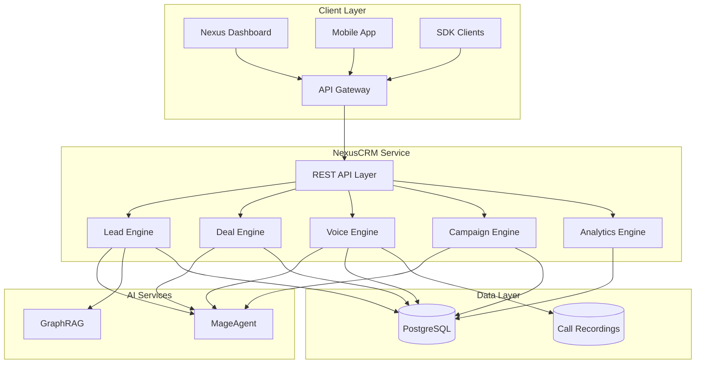
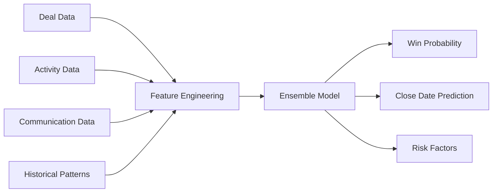
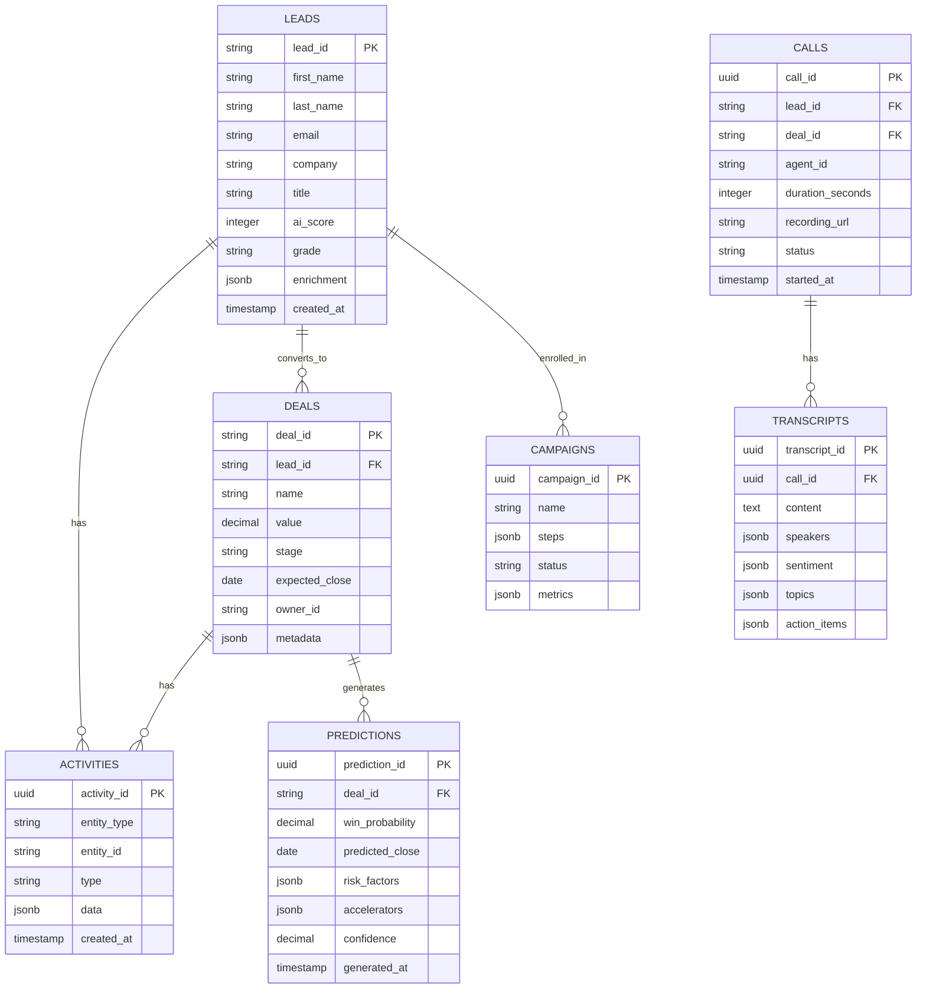
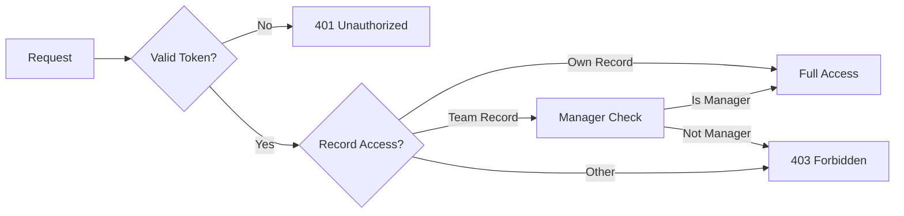

# NexusCRM Architecture

Technical architecture and system design for the AI-powered CRM platform.

---

## System Overview



---

## Core Components

### 1. REST API Layer

| Endpoint | Method | Description |
|----------|--------|-------------|
| `/api/v1/leads` | POST | Create lead with AI scoring |
| `/api/v1/leads/:id` | GET | Get lead details |
| `/api/v1/leads/:id/score` | POST | Trigger AI scoring |
| `/api/v1/deals` | GET | List deals |
| `/api/v1/deals/:id/predict` | POST | Get AI prediction |
| `/api/v1/calls/outbound` | POST | Initiate call |
| `/api/v1/calls/:id/transcript` | GET | Get transcript |

### 2. Lead Engine

AI-powered lead management and scoring.

**Scoring Signals:**
- Firmographic fit (company size, industry)
- Demographic fit (title, seniority)
- Behavioral signals (engagement, intent)
- Technographic data
- External enrichment

### 3. Deal Engine

Predictive deal analytics and management.

**Prediction Model:**


### 4. Voice Engine

AI-powered calling with real-time transcription.

**Capabilities:**
- Real-time transcription
- Sentiment analysis
- Keyword detection
- Coaching prompts
- Call summarization

### 5. Campaign Engine

Multi-channel campaign orchestration.

**Channels:**
- Email
- SMS
- Voice
- LinkedIn
- Custom webhooks

### 6. Analytics Engine

Comprehensive CRM analytics.

**Metrics:**
- Pipeline velocity
- Win/loss analysis
- Rep performance
- Campaign effectiveness

---

## Data Model



---

## AI Model Architecture

### Lead Scoring Model

**Features:**
- Firmographic (20+ signals)
- Behavioral (email opens, web visits)
- Intent (content downloads, demo requests)
- Fit (ICP matching score)

**Model Stack:**
- Gradient Boosted Trees for scoring
- Neural network for behavior prediction
- Rule engine for explicit criteria

### Deal Prediction Model

**Input Signals:**
- Stage progression velocity
- Activity frequency
- Stakeholder engagement
- Email sentiment
- Call sentiment
- Competitor mentions
- Budget discussions

**Output:**
- Win probability (0-1)
- Predicted close date
- Confidence score
- Risk factors
- Recommended actions

---

## Security Model

### Authentication
- Bearer token via Nexus API Gateway
- Voice API uses signed tokens
- Webhook signature verification

### Authorization
- Role-based: Rep, Manager, Admin
- Territory-based access
- Record ownership enforcement

### Data Protection
- Call recordings encrypted
- PII masking in transcripts
- CCPA/GDPR compliance
- Data retention policies



---

## Deployment Architecture

### Kubernetes Configuration

```yaml
apiVersion: apps/v1
kind: Deployment
metadata:
  name: nexus-crm
  namespace: nexus-plugins
spec:
  replicas: 3
  selector:
    matchLabels:
      app: nexus-crm
  template:
    spec:
      containers:
      - name: crm-api
        image: adverant/nexus-crm:1.0.0
        ports:
        - containerPort: 8080
        resources:
          requests:
            memory: "1Gi"
            cpu: "500m"
          limits:
            memory: "2Gi"
            cpu: "1000m"
        livenessProbe:
          httpGet:
            path: /live
            port: 8080
        readinessProbe:
          httpGet:
            path: /ready
            port: 8080
```

### Resource Allocation

| Component | CPU | Memory |
|-----------|-----|--------|
| API Server | 500m-1000m | 1Gi-2Gi |
| Voice Server | 1000m-2000m | 2Gi-4Gi |
| ML Server | 500m-1000m | 2Gi-4Gi |

---

## Integration Points

### Voice Providers

- Twilio (primary)
- Vonage (backup)
- Custom SIP trunks (enterprise)

### Email Providers

- SendGrid
- Mailgun
- Custom SMTP

### Event Bus

| Event | Payload | Subscribers |
|-------|---------|-------------|
| `crm.lead.created` | Lead data | Scoring, Campaigns |
| `crm.deal.updated` | Deal data | Predictions, Analytics |
| `crm.call.completed` | Call data | Transcription, Coaching |

---

## Performance

### Rate Limits

| Tier | Requests/min | Voice Minutes |
|------|--------------|---------------|
| Starter | 60 | 100/mo |
| Professional | 300 | 1,000/mo |
| Enterprise | Custom | Unlimited |

### Latency Targets

| Operation | Target | P99 |
|-----------|--------|-----|
| Lead Scoring | 200ms | 500ms |
| Deal Prediction | 300ms | 800ms |
| Call Transcription | Real-time | <2s delay |

---

## Monitoring

### Metrics (Prometheus)

```
# Lead metrics
crm_leads_created_total{source}
crm_lead_score_distribution{grade}

# Deal metrics
crm_deals_created_total{stage}
crm_deal_prediction_accuracy

# Voice metrics
crm_calls_total{direction, status}
crm_call_duration_seconds
```

### Alerting

| Alert | Condition | Severity |
|-------|-----------|----------|
| Lead Scoring Failure | >1% error rate | Critical |
| Voice Service Down | No calls in 10 min | Critical |
| Low Prediction Accuracy | <70% accuracy | Warning |

---

## Next Steps

- [Quick Start Guide](./QUICKSTART.md) - Get started quickly
- [Use Cases](./USE-CASES.md) - Implementation scenarios
- [API Reference](./docs/api-reference/endpoints.md) - Complete docs
