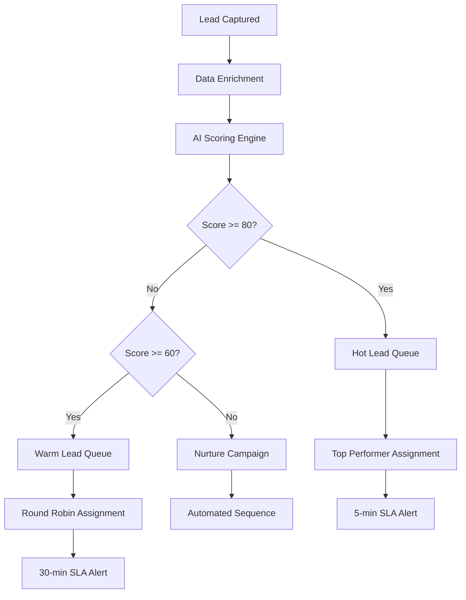

# NexusCRM Use Cases

Real-world implementation scenarios for AI-powered sales and customer relationship management.

---

## Use Case 1: Intelligent Lead Scoring and Routing

### Problem

Sales team wastes 60% of time on low-quality leads. Manual lead qualification is slow and inconsistent.

### Solution

AI-powered lead scoring that evaluates fit, intent, and engagement signals in real-time.

### Implementation

```typescript
import { NexusClient } from '@adverant/nexus-sdk';

class IntelligentLeadRouter {
  private crm;

  constructor(nexusClient: NexusClient) {
    this.crm = nexusClient.plugin('nexus-crm');
  }

  async processIncomingLead(leadData: LeadInput) {
    // Create lead with AI scoring
    const lead = await this.crm.leads.create({
      ...leadData,
      enableAIScoring: true,
      enrichData: true // Pull company data, technographics, etc.
    });

    // Route based on score and segment
    const routing = await this.determineRouting(lead);

    // Assign to appropriate rep or queue
    await this.crm.leads.assign({
      leadId: lead.leadId,
      assignee: routing.assignee,
      priority: routing.priority,
      sla: routing.slaMinutes
    });

    // Trigger automated nurture if score is low
    if (lead.aiScore.score < 50) {
      await this.crm.campaigns.enroll({
        leadId: lead.leadId,
        campaignId: 'nurture_low_score',
        waitForQualification: true
      });
    }

    return {
      lead,
      routing,
      automatedActions: this.getAutomatedActions(lead)
    };
  }

  private async determineRouting(lead: Lead) {
    if (lead.aiScore.score >= 80) {
      return {
        assignee: await this.getTopPerformer(lead.segment),
        priority: 'urgent',
        slaMinutes: 5
      };
    } else if (lead.aiScore.score >= 60) {
      return {
        assignee: await this.getRoundRobinRep(lead.segment),
        priority: 'high',
        slaMinutes: 30
      };
    } else {
      return {
        assignee: 'sdr_queue',
        priority: 'normal',
        slaMinutes: 240
      };
    }
  }
}
```

### Flow Diagram



### Business Impact

- **Improved lead-to-opportunity conversion** through intelligent prioritization
- **Faster response times** for high-priority leads
- **Less time spent** on low-quality leads

---

## Use Case 2: Conversation Intelligence and Coaching

### Problem

Sales managers can't review all calls. Rep coaching is inconsistent and subjective.

### Solution

AI-powered call analysis with automated coaching insights.

### Implementation

```typescript
class ConversationIntelligence {
  private crm;

  constructor(nexusClient: NexusClient) {
    this.crm = nexusClient.plugin('nexus-crm');
  }

  async analyzeCall(callId: string) {
    // Get full call analysis
    const analysis = await this.crm.calls.analyze({
      callId,
      analysisTypes: [
        'transcription',
        'sentiment',
        'topics',
        'objections',
        'questions',
        'action_items',
        'talk_ratio',
        'filler_words',
        'competitor_mentions'
      ]
    });

    // Generate coaching insights
    const coaching = await this.crm.coaching.generate({
      callId,
      analysis,
      compareToTopPerformers: true
    });

    // Update deal with insights
    if (analysis.dealId) {
      await this.crm.deals.update({
        dealId: analysis.dealId,
        insights: {
          lastCallSentiment: analysis.sentiment.overall,
          objections: analysis.objections,
          competitorsMentioned: analysis.competitors,
          buyingSignals: analysis.buyingSignals
        }
      });
    }

    return {
      analysis,
      coaching,
      highlights: this.extractHighlights(analysis)
    };
  }

  async getRepPerformance(repId: string, period: string) {
    const metrics = await this.crm.analytics.repPerformance({
      repId,
      period,
      metrics: [
        'call_count',
        'avg_talk_ratio',
        'avg_sentiment',
        'objection_handling_score',
        'discovery_question_count',
        'next_step_close_rate'
      ]
    });

    const benchmarks = await this.crm.analytics.teamBenchmarks({
      period,
      metrics: metrics.metricNames
    });

    return {
      metrics,
      benchmarks,
      coachingAreas: this.identifyCoachingAreas(metrics, benchmarks)
    };
  }
}
```

### Business Impact

- **Improved objection handling** through AI-powered coaching
- **Time saved** on manual call reviews
- **Faster new rep ramp time** with consistent coaching

---

## Use Case 3: AI-Powered Deal Prediction

### Problem

Forecasts are inaccurate. Reps are optimistic, and deals slip unexpectedly.

### Solution

AI deal scoring that analyzes all signals to predict outcomes.

### Implementation

```python
from nexus_sdk import NexusClient
from datetime import datetime

class DealPredictionService:
    def __init__(self, nexus_client: NexusClient):
        self.crm = nexus_client.plugin("nexus-crm")

    async def predict_pipeline(self, forecast_period: str):
        # Get all deals in pipeline
        deals = await self.crm.deals.list(
            stage=["discovery", "demo", "proposal", "negotiation"],
            close_date_range=forecast_period
        )

        predictions = []
        for deal in deals.items:
            prediction = await self.crm.deals.predict(deal_id=deal.deal_id)

            predictions.append({
                "deal_id": deal.deal_id,
                "name": deal.name,
                "value": deal.value,
                "stage": deal.stage,
                "win_probability": prediction.win_probability,
                "weighted_value": deal.value * prediction.win_probability,
                "risk_factors": prediction.risk_factors,
                "predicted_close": prediction.predicted_close_date,
                "confidence": prediction.confidence
            })

        # Aggregate forecast
        forecast = {
            "period": forecast_period,
            "total_pipeline": sum(p["value"] for p in predictions),
            "weighted_forecast": sum(p["weighted_value"] for p in predictions),
            "high_confidence": sum(
                p["weighted_value"] for p in predictions
                if p["confidence"] > 0.8
            ),
            "at_risk_deals": [
                p for p in predictions
                if p["win_probability"] < 0.3 and p["stage"] in ["proposal", "negotiation"]
            ]
        }

        return {
            "forecast": forecast,
            "predictions": predictions
        }

    async def get_deal_health(self, deal_id: str):
        prediction = await self.crm.deals.predict(deal_id=deal_id)

        # Get engagement analysis
        engagement = await self.crm.deals.analyze_engagement(deal_id=deal_id)

        return {
            "prediction": prediction,
            "engagement": {
                "email_response_rate": engagement.email_response_rate,
                "meeting_attendance": engagement.meeting_attendance,
                "document_views": engagement.document_views,
                "stakeholders_engaged": engagement.stakeholders_engaged
            },
            "health_score": self.calculate_health(prediction, engagement),
            "recommended_actions": prediction.recommendations
        }
```

### Business Impact

- **Improved forecast accuracy** through AI predictions
- **Fewer slipped deals** with risk identification
- **Early warning** on at-risk deals

---

## Use Case 4: Multi-Channel Campaign Automation

### Problem

Marketing and sales not aligned. Leads receive inconsistent messaging across channels.

### Solution

AI-orchestrated campaigns across email, SMS, voice, and social.

### Implementation

```typescript
class CampaignOrchestrator {
  private crm;

  constructor(nexusClient: NexusClient) {
    this.crm = nexusClient.plugin('nexus-crm');
  }

  async createNurtureSequence(segmentId: string) {
    const campaign = await this.crm.campaigns.create({
      name: 'Enterprise Nurture Sequence',
      segment: segmentId,
      goal: 'demo_booking',
      channels: ['email', 'sms', 'voice', 'linkedin'],
      aiOptimized: true
    });

    // Define sequence steps
    const steps = [
      {
        day: 0,
        channel: 'email',
        template: 'welcome_value_prop',
        personalize: true
      },
      {
        day: 2,
        channel: 'linkedin',
        action: 'connection_request',
        message: 'personalized_intro'
      },
      {
        day: 4,
        channel: 'email',
        template: 'case_study',
        condition: 'opened_previous'
      },
      {
        day: 7,
        channel: 'sms',
        template: 'quick_question',
        condition: 'not_responded_to_emails'
      },
      {
        day: 10,
        channel: 'voice',
        action: 'ai_call',
        script: 'discovery_intro',
        condition: 'score_above_60'
      }
    ];

    await this.crm.campaigns.addSteps({
      campaignId: campaign.campaignId,
      steps
    });

    // Enable AI optimization
    await this.crm.campaigns.enableOptimization({
      campaignId: campaign.campaignId,
      optimize: [
        'send_time',
        'channel_preference',
        'message_content',
        'sequence_order'
      ]
    });

    return campaign;
  }

  async handleResponse(leadId: string, response: Response) {
    // AI determines next best action
    const nextAction = await this.crm.leads.nextBestAction({
      leadId,
      context: {
        response,
        previousTouches: await this.crm.leads.getTouchHistory(leadId)
      }
    });

    // Execute recommended action
    await this.crm.actions.execute({
      leadId,
      action: nextAction.action,
      params: nextAction.params
    });

    return nextAction;
  }
}
```

### Business Impact

- **Higher campaign engagement** through personalization
- **More qualified meetings booked** with AI optimization
- **Consistent messaging** across all channels

---

## Use Case 5: Customer 360 View with AI Insights

### Problem

Customer data scattered across systems. Reps lack context for conversations.

### Solution

Unified customer view with AI-generated insights and recommendations.

### Implementation

```python
class Customer360Service:
    def __init__(self, nexus_client: NexusClient):
        self.crm = nexus_client.plugin("nexus-crm")

    async def get_customer_view(self, customer_id: str):
        # Aggregate all customer data
        profile = await self.crm.customers.get_360(
            customer_id=customer_id,
            include=[
                "contact_info",
                "company_info",
                "deal_history",
                "support_tickets",
                "product_usage",
                "communications",
                "documents"
            ]
        )

        # Generate AI insights
        insights = await self.crm.customers.generate_insights(
            customer_id=customer_id,
            focus_areas=[
                "health_score",
                "churn_risk",
                "upsell_opportunities",
                "relationship_strength",
                "engagement_trends"
            ]
        )

        # Get recommended actions
        recommendations = await self.crm.customers.get_recommendations(
            customer_id=customer_id,
            context={
                "profile": profile,
                "insights": insights
            }
        )

        return {
            "profile": profile,
            "insights": insights,
            "recommendations": recommendations,
            "talking_points": self.generate_talking_points(profile, insights)
        }

    def generate_talking_points(self, profile, insights):
        talking_points = []

        if insights.recent_support_issues:
            talking_points.append({
                "topic": "Recent Support",
                "point": f"Address {len(insights.recent_support_issues)} recent tickets",
                "sentiment": "empathetic"
            })

        if insights.upsell_opportunities:
            talking_points.append({
                "topic": "Growth Opportunity",
                "point": insights.upsell_opportunities[0].description,
                "value": insights.upsell_opportunities[0].potential_value
            })

        if insights.usage_highlights:
            talking_points.append({
                "topic": "Success Story",
                "point": f"Highlight {insights.usage_highlights[0].feature} adoption",
                "impact": insights.usage_highlights[0].business_impact
            })

        return talking_points
```

### Business Impact

- **Complete customer context** in one view
- **Increased upsell opportunities** through AI insights
- **Proactive churn prevention**

---

## Integration with Nexus Ecosystem

| Plugin | Integration |
|--------|-------------|
| **PropertyMgmt** | Sync leads from property inquiries |
| **GuestExperience** | Guest profiles become CRM contacts |
| **Pricing** | Deal value optimization |
| **GraphRAG** | Customer knowledge base |

---

## Next Steps

- [Architecture Overview](./ARCHITECTURE.md) - AI models and system design
- [API Reference](./docs/api-reference/endpoints.md) - Complete endpoint docs
- [Support](https://community.adverant.ai) - Community forum
